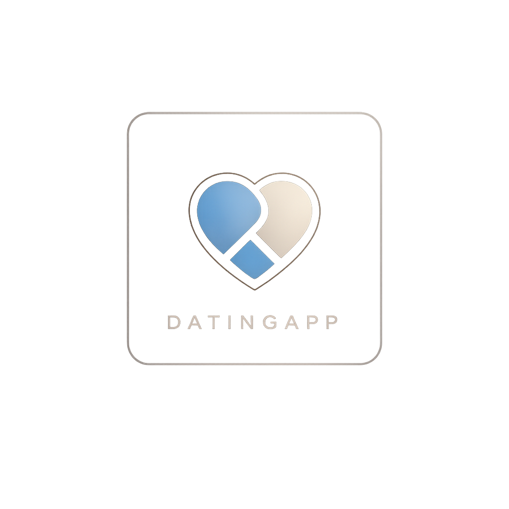

# DatingApp

<p align="center">
  
</p>

<p align="center">
  <strong>A premium, luxury, iOS-first dating experience built with Flutter.</strong>
</p>

<p align="center">
  <a href="https://flutter.dev"></a>
  <a href="https://dart.dev"></a>
  <a href="https://developer.apple.com/ios/"></a>
  <a href="https://developer.android.com/"></a>
  <a href="https://opensource.org/licenses/MIT"></a>
  <a href="https://github.com/rrousselGit/riverpod"></a>
</p>

---

## Project Overview

**DatingApp** is a startup-grade, production-ready mobile application designed specifically for iOS (with native-like fallbacks for Android). It moves away from generic, boxy Material Design interfaces, instead utilizing a luxurious, elegant, and minimal interface inspired by the designs of Apple Wallet, Apple Music, Linear, Raya, and Hinge.

The core swipe mechanics feature fine-tuned rotation pivots, physics-based springs, and haptic feedback profiles that mimic a tactile App Store-quality user experience.

---

## Features

- **Apple Human Interface Guidelines (HIG) Alignment**: Tailored specifically for iPhone viewports, safe areas, 44x44 touch target padding, and Cupertino scroll physics.
- **120 FPS Drag Physics**: Physics-based gestural card swiping with dynamic rotation pivot points shifting according to screen drag heights.
- **Unified Design System**: Centralized parameters for Radius, Spacing, Gradients, Shadows, Blurs, and Glassmorphism effects.
- **Match Animation Overlay**: Fluid, spring-overshoot avatar slide animations and elastic header presentation using custom interval schedules.
- **Offline-First Storage**: Cached profiles, swiping records, and matches stored locally inside Hive boxes, enabling offline launching.
- **Stateful Navigation**: Persistent nested navigation tabs configured using GoRouter's stateful shell branches.
- **Test-Driven Architecture**: Fully modular ViewModels tested in isolation against repository interfaces.

---

## Project Architecture

DatingApp is built using **Clean Architecture** with a **Feature-First** layout, combined with the **MVVM (Model-View-ViewModel)** design pattern. 

### Why MVVM + Clean Architecture?
1. **Decoupling**: The UI layer communicates exclusively with the ViewModels, which in turn call abstract Repository contracts. 
2. **REST API Readiness**: Swapping local database storage for online APIs requires modifying *only* the repository implementations. The ViewModels and UI controllers remain unchanged.
3. **Testability**: Presenting mock business environments is trivial because repositories are wrapped in clean interfaces.

---

## Technology Stack

- **Flutter & Dart SDK**: Modern compilation target with null-safety and strict typing.
- **Flutter Riverpod (`v2`)**: Global reactive state management utilizing unidirectional data flows.
- **Hive & Hive Flutter**: High-performance, lightweight key-value database for local offline caching.
- **GoRouter (`v14`)**: Declarative routing engine supporting deep links, nested shell stacks, and Cupertino transitions.
- **Dio (`v5`)**: Client for networking, preconfigured with Bearer JWT interceptors, automatic 401 token refresh loops, and custom log outputs.
- **Google Fonts**: Inter typographic fallback loading dynamically without asset bundling weight.
- **Path Provider**: Standard platform-specific directories lookup for Hive database initializations.

---

## Design System

Every widget in DatingApp strictly consumes the centralized token systems defined in `lib/core/theme`:

- **AppColors**: Map raw color palette hex codes into functional tokens (`primary`, `background`, `surface`, `card`, `accent`, `textPrimary`, etc.).
- **AppTypography**: Standardizes text structures using Inter/SF Pro scaling factors clamped between device boundaries.
- **AppSpacing**: Declares uniform margin and padding boxes (`SizedBox` shortcuts: `8.vSpace`, `16.hSpace`).
- **AppRadius**: Unified borders definition for luxury glassmorphism edges (`BorderRadius.circular(24)`).
- **AppBlur / Glass Effects**: Custom BackdropFilter values (`AppBlur.heavy`) to render beautiful translucent iOS overlays.

---

## Color Palette

| Name | Hex Code | Visual Target |
| :--- | :--- | :--- |
| **Primary** | `#79A3C3` | Classic Blue Accent, interactive elements |
| **Dark Brown** | `#3A2119` | Deep luxury undertones, card details |
| **Soft Blue** | `#D2E2EC` | Airy backgrounds, border reflections |
| **Warm Beige** | `#EBCDB7` | Golden highlights, premium indicators |
| **Muted Brown** | `#957662` | Secondary body copy, subtitle accents |
| **Black** | `#000000` | Deep dark mode background |
| **White** | `#FFFFFF` | Core highlights, cards, readable primary copy |

---

## Getting Started

### Prerequisites
- Flutter SDK: `^3.11.5`
- Dart SDK: `^3.0.0`
- Target Platforms: iOS 13.0+ / Android API 21+

### Installation & Run

1. Clone the repository:
   ```bash
   git clone https://github.com/username/dating_app.git
   cd dating_app
   ```

2. Retrieve project packages:
   ```bash
   flutter pub get
   ```

3. Run the application:
   ```bash
   flutter run
   ```

> [!NOTE]
> On the first app boot, the local Hive database will automatically seed 5 premium dummy user profiles utilizing high-quality portrait imagery to populate your swipe deck.

---

## Project Configurations

- **Assets Directory**: Located in `assets/icon/`. Houses the official iOS App Store-quality squircle brand logo (`app_icon.png`).
- **Launch Icons**: Launcher icons are automatically generated by the asset package. If you make modifications to the icon, regenerate using:
  ```bash
  dart run flutter_launcher_icons
  ```
- **Analysis Configuration**: Strict coding rules (`analysis_options.yaml`) prevent empty loops, relative imports, and ensure `const` construct optimization checks.

---

## Coding Standards & Principles

- **SOLID & Clean Code**: Single Responsibility classes, Interface Segregation, and dependency injection.
- **DRY & KISS**: Extracting duplicated widget builds (like circular gestures and badges) into reusable shared widgets.
- **Repaint Isolation**: Implementing `RepaintBoundary` wrappers on moving widgets (swipe cards) and static layouts (top bars and buttons) to prevent rendering pipelines from rebuilding static background pixels.
- **Accessibility (VoiceOver)**: Explicit `Semantics` labels wrapping swipe cards and action controls to allow seamless screen reader traversal.

---

## Supported Screens

- [x] **Splash**: Instantiates bindings, logs setup parameters, and auto-routes after 2 seconds.
- [x] **Home Swipe**: Physical gestural cards deck, bottom floating action controls, and Match overlays.
- [ ] **Explore Screen** (Stubbed)
- [ ] **Likes Feed** (Stubbed)
- [ ] **Chat Details & List** (Stubbed)
- [ ] **Profile Settings** (Stubbed)
- [ ] **Premium Subscription Plan** (Stubbed)

---

## Future Roadmap

- [ ] **Firebase Authentication**: Seamless Google and Apple Sign-In support.
- [ ] **WebSocket Real-Time Chat**: Live socket pipelines connecting user matches.
- [ ] **Location/Radius Filter**: Dynamic Geolocation querying via Hive spatial indices.
- [ ] **In-App Purchasing**: Premium tier subscription locks using RevenueCat.
- [ ] **AI-Driven Matching Feed**: Interest tag comparison algorithms.

---

## Performance Optimization

- **`const` Widget Trees**: Maximizes element tree caching.
- **Lazy Rendering**: Only loads active indices in stacked decks.
- **Cached Layout Paints**: Utilizes `RepaintBoundary` layers to split GPU pipelines into isolated raster threads.

---

## Contributing

We welcome contributions from senior developers:
1. Fork the Project.
2. Create your Feature Branch (`git checkout -b feature/AmazingFeature`).
3. Commit your Changes (`git commit -m 'Add some AmazingFeature'`).
4. Push to the Branch (`git push origin feature/AmazingFeature`).
5. Open a Pull Request.

Please ensure all tests pass (`flutter test`) and code conforms to the linter conventions before submitting.

---

## License

Distributed under the MIT License. See `LICENSE` for more information.

---

## Author

* **Sayan Banik**
  * *Software Architect & Flutter Engineer*
  * GitHub: [@baniksayan](https://github.com/baniksayan)
  * LinkedIn: [Sayan Banik](https://linkedin.com/in/sayan-banik)
  * Email: [sayanbanikcob@gmail.com](mailto:sayanbanikcob@gmail.com)